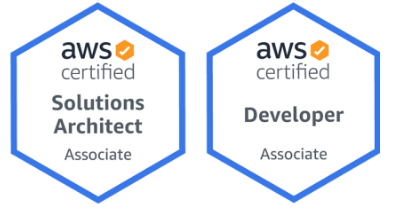

## Hi there, This is Venkatesh   
<!--- ### Hi there 👋 This is Venkatesh  --->
> Engineer by Degree, AWS Architect by Profession, and a DevOps Enthusiast.  

 

Venkatesh is an Engineer at heart. He is a currently working with IBM, Designing Automated solutions on AWS and other Cloud platforms. Venkatesh is AWS 2x Certified, and also a Udemy Instructor. 

- 🔭 I’m currently working on : Designing AWS solutions for customers, Automations using Ansible, Python
- 💬 Ask me about Cloud, AWS, Devops, Automation, How to become instructor on Udemy.
- My Udemy Course :
    -  

    -  
- Follow me on LinkedIn :point_down: or Twitter :point_down: and dont forget to ask me for FREE Coupon to my   Course  
- 📫 How to reach me:
 

<!---  --->
  
- Find more about me at : https://venkateshk111.github.io/

## :muscle: Skills :muscle: :

<!---
### Github Stats

<h3> 🤝🏻 Connect with Me </h3>

--->

⭐️ From [@Venkateshk111](https://github.com/venkateshk111)
