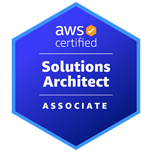
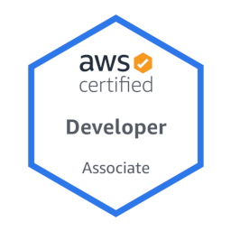
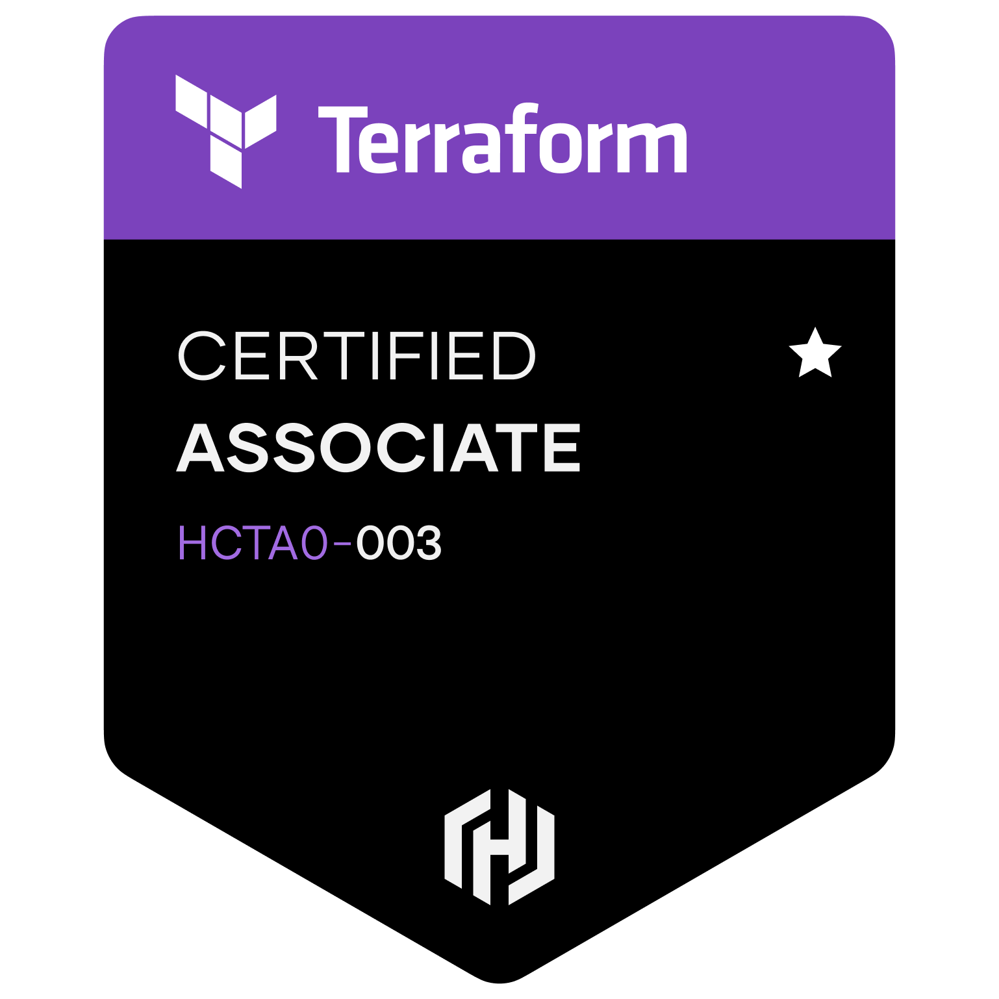

# Hi there, I'm Venkatesh K 👋

  

  <em>I design and scale enterprise-grade AWS platforms that are automated, secure, and cost-efficient.</em>

  
  &nbsp;
  
  &nbsp;
  
  &nbsp;
  
  &nbsp;
  

---

## 🏅 Certifications

  
  
  
  
  

  
  
  
  
  

---

## 📊 By the Numbers

| 🗓️ Experience | ☁️ AWS Certifications | 💰 Cloud Savings | 🎓 Udemy Students | ⭐ GitHub Stars |
|:---:|:---:|:---:|:---:|:---:|
| **19+ Years** | **4x Certified** | **$220K+ Annual** | **30,200+** | **90+** |

---

## 🛠️ What I Work With

  
  
  
  
  
  
  
  

---

## 🚀 Featured Project

### ⚡ [AWS DevOps Command Center](https://venkateshk111.github.io/aws-devops-command-center/)

> A fast, searchable command reference built for AWS and DevOps engineers.

**600+ commands** covering AWS CLI, Terraform, Git, Ansible, Docker, Kubernetes, Helm and Linux — with plain-English search and one-click copy. Zero dependencies. Works offline.

---

## 🎓 Teaching

&nbsp;

30,200+ students · 2 courses · ⭐ 4.6 and 4.2 rated

---

## 📈 GitHub Stats

  
  &nbsp;
  

---

## 🌱 AWS Community Builder

Proud member of the **AWS Community Builder** program — contributing to the cloud community through technical blog posts, open-source projects, and peer knowledge sharing.

---

  <em>⭐️ If you find any of my projects useful, a star goes a long way!</em>
    
  

